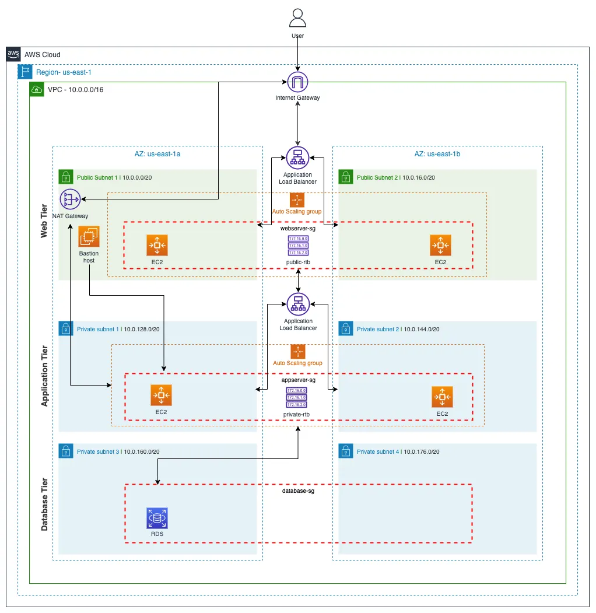

# AWS 3-Tier Architecture Application Deployment

A production-style **3-Tier Web Application** deployed on **AWS Free Tier** using **React**, **Node.js**, **Nginx**, **Amazon RDS**, **Application Load Balancers**, **Route 53**, and **AWS Certificate Manager (ACM)**.

The application follows a standard 3-tier architecture where the frontend, backend, and database are deployed in separate layers inside a custom Amazon VPC.

> **Note:** This project was deployed on AWS Free Tier for learning and portfolio purposes. To avoid ongoing AWS charges, the live infrastructure has been removed. All deployment steps, architecture, source code, and screenshots are available in this repository.

---

# Architecture



---

# Project Architecture

User

↓

Route 53 (Custom Domain)

↓

External Application Load Balancer

↓

Web Tier (EC2 + Nginx + React)

↓

Internal Application Load Balancer

↓

Application Tier (EC2 + Node.js + Express + PM2)

↓

Amazon RDS (MySQL)

---

# AWS Services Used

- Amazon VPC
- Public & Private Subnets
- Internet Gateway
- NAT Gateway
- Route Tables
- Security Groups
- Amazon EC2
- Amazon S3
- IAM Role
- AWS Systems Manager (SSM)
- Amazon RDS (MySQL)
- Application Load Balancer (Internal)
- Application Load Balancer (External)
- Amazon Route 53
- AWS Certificate Manager (ACM)
- Auto Scaling
- Launch Template
- Amazon Machine Image (AMI)

---

# Features

- Production-style 3-Tier Architecture
- React Frontend
- Node.js + Express Backend
- MySQL Database (Amazon RDS)
- Reverse Proxy using Nginx
- Internal & External Application Load Balancers
- Custom Domain using Route 53
- HTTPS using AWS Certificate Manager
- Secure Network using Public & Private Subnets
- Security Group based communication
- Session Manager access to private EC2
- PM2 Process Manager
- Auto Scaling Ready Architecture

---

# Project Structure

```
application-code/
│
├── app-tier/
│   ├── index.js
│   ├── TransactionService.js
│   ├── DbConfig.js
│   └── package.json
│
├── web-tier/
│   ├── src/
│   ├── public/
│   ├── build/
│   └── package.json
│
docs/
├── screenshots/
└── architecture-diagram.png

deployment-steps.md

README.md

LICENSE
```

---

# Deployment Guide

A complete step-by-step deployment guide is available here.

**deployment-steps.md**

The guide includes:

- VPC Creation
- Security Groups
- IAM Role
- Amazon RDS
- Application Tier Deployment
- Web Tier Deployment
- Internal ALB
- External ALB
- Route 53
- ACM
- HTTPS
- Auto Scaling

---

# Screenshots

Project screenshots are available inside

docs/screenshots/

including

- VPC
- Security Groups
- RDS
- App Server
- Web Server
- Internal ALB
- External ALB
- Route 53
- ACM
- HTTPS Working
- Database Records

---

# Security

- Database deployed inside Private Subnets
- RDS Public Access Disabled
- Internal ALB for Backend Communication
- Security Group based access control
- Session Manager used instead of Bastion Host

---

# Notes

- Developed for learning real-world AWS architecture.
- Deployed using AWS Free Tier.
- Live infrastructure has been removed after successful testing to avoid AWS charges.

---

# Author

**Chhatrapal Janghel**

AWS Cloud | DevOps Engineer

GitHub:
https://github.com/chhatrapal7

LinkedIn:
https://linkedin.com/in/chhatrapal-janghel-pal7
